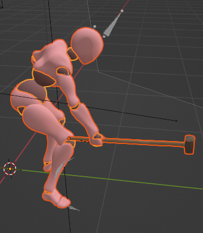
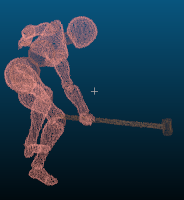
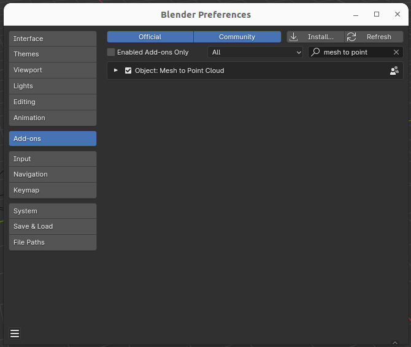
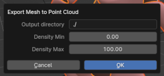

# Mesh to colored point cloud

Blender script to convert a mesh with a principled BRDF material with a base color or a texture into a colored point cloud using Poisson Disk sampling.

## Installation

Download the `mesh_to_pcd.zip` file from the [latest release](https://github.com/cjaverliat/MeshToPointCloud/releases). In Blender go to `Edit > Preferences > Add-ons`, click `Install...` and select the zip file. Confirm the install by clicking on `Install Add-on` and enable the addon from the list.

## Usage

Select one or several meshes, open the contextual menu and run `Export Mesh To Point Cloud`. A dialog will appear asking for the parameters for the output directory and the Poisson Disk Sampling operations.

